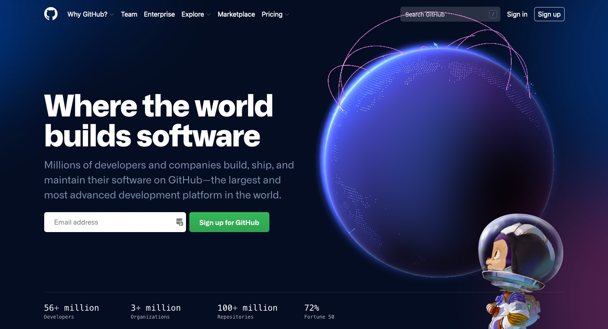
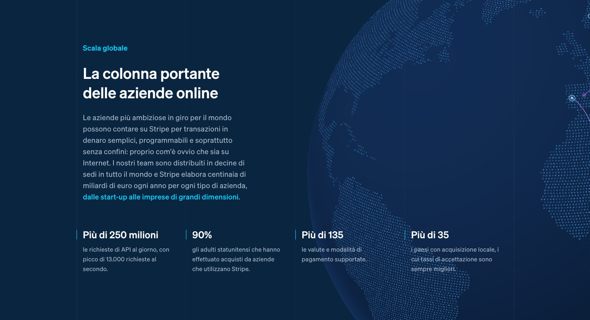

## The birth of the obsession

A recent obsession of mine has been the 3D Globes that both [GitHub](https://github.com) and [Stripe](https://stripe.com) have on their landing pages.

I'm fairly certain that Strip did it first, especially because they have a [comprehensive guide](https://stripe.com/blog/globe) on their process.

Its been a long time coming, but I want one too.

## My take on the concept.

Once I successfully manage to get the globe working, I want to wire it up to work with a creative work history section, where you can click next and previous and the globe will mark the location on the map, especially cool to show off my time in italy.

